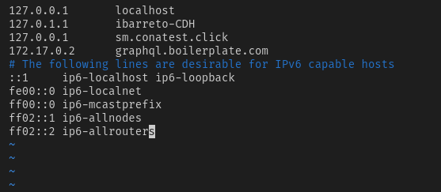
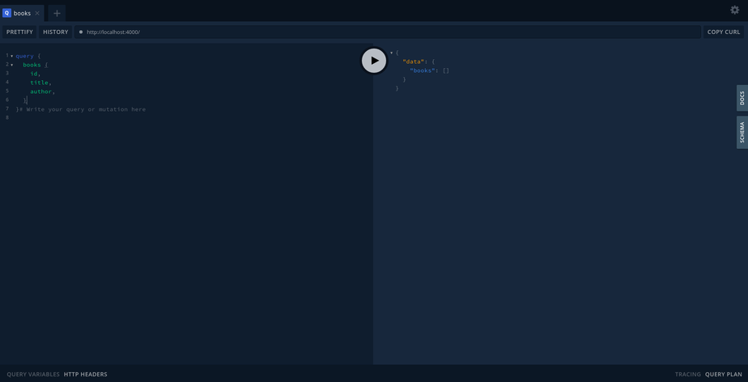
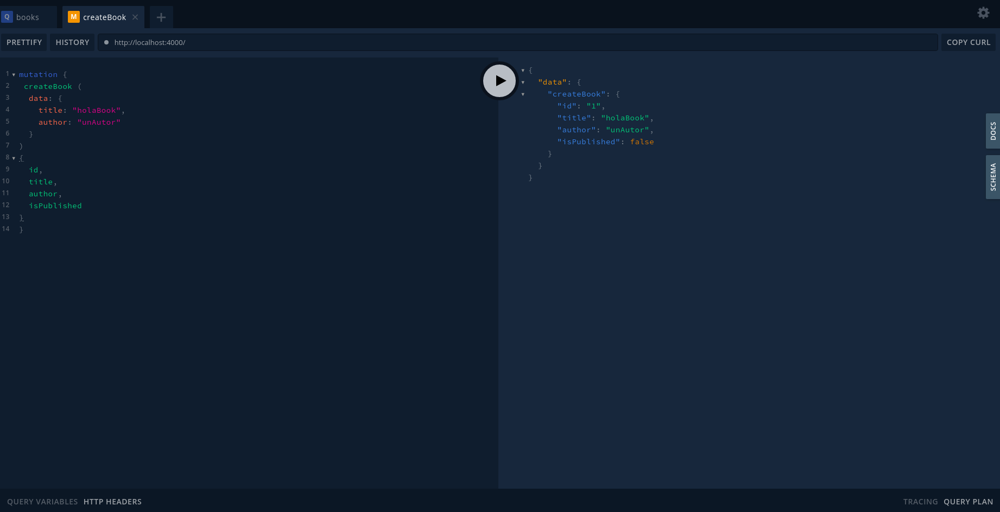
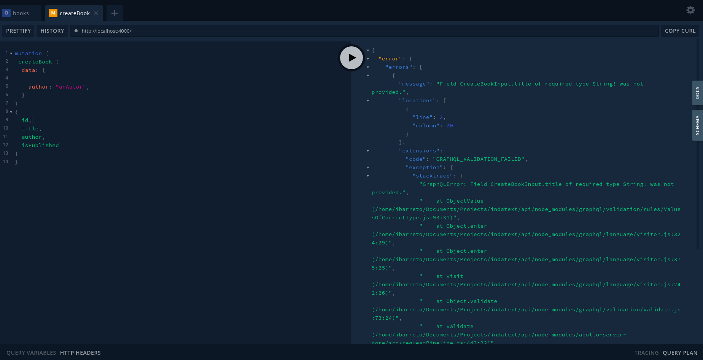
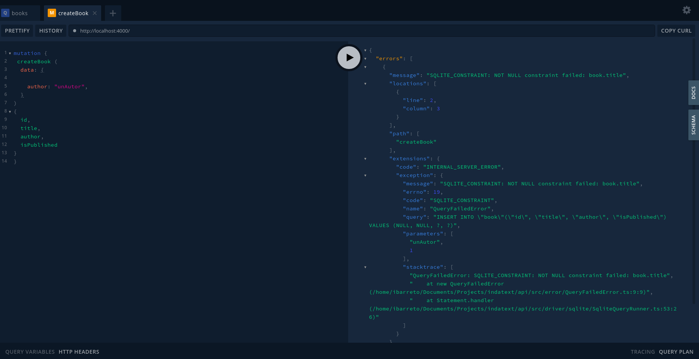
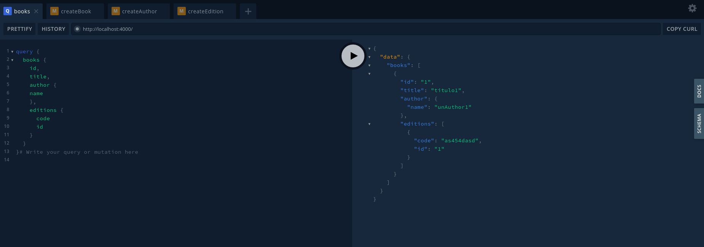

<!-- omit in toc -->
# Express - GraphQL’s API

Basicamee es un boilerplate de nodejs que permite correr de forma amigable una api con `GraphQL`, montada sobre `Express.js`
y que utiliza como driver de base de datos `TypeORM`.

Pero no solo es un boilerplate, sino que en las descripciones y en los step by step lleva algo de bases teoricas sobre las que se
afiraman cada una de las cosas que vmaos haciendo. De todos modos usando el indice se puede ir directamente a una base teorica
especifica o tambien ir directo a ver como implementar el proyecto tanto en dev como en test,
para utilizarlo y seguir desarrollando a partir de el.

<!-- omit in toc -->
## Inidice

- [Resumen](#resumen)
- [Prerequisitos para usar este boilerplate](#prerequisitos-para-usar-este-boilerplate)
- [Dependencias nodejs](#dependencias-nodejs)
  - [Algunas de las dependencias de nodejs usadas en el boilerplate](#algunas-de-las-dependencias-de-nodejs-usadas-en-el-boilerplate)
  - [Dependencias usadas en el entrono de development](#dependencias-usadas-en-el-entrono-de-development)
- [Correr modo development](#correr-modo-development)
- [Correr modo test](#correr-modo-test)
  - [Correr test environment en docker-compose](#correr-test-environment-en-docker-compose)
  - [Correr test environment en kubernetes](#correr-test-environment-en-kubernetes)
- [Configuración de typescript](#configuración-de-typescript)
- [Configuracion de la conexión de typeorm con la base de datos](#configuracion-de-la-conexión-de-typeorm-con-la-base-de-datos)
  - [Sqlite](#sqlite)
- [Estructura del directorio](#estructura-del-directorio)
- [Descripción del codigo base en index](#descripción-del-codigo-base-en-index)
- [Descripcion del codigo](#descripcion-del-codigo)
  - [Resolvers](#resolvers)
  - [Models](#models)
  - [Object Types](#object-types)
  - [Database CRUD](#database-crud)
  - [Relations](#relations)
  - [Relacion uno a uno](#relacion-uno-a-uno)
  - [Relacion uno a muchos](#relacion-uno-a-muchos)
- [Logger](#logger)
- [Autenticacion y roles](#autenticacion-y-roles)

## Resumen

Para hacer una api `GraphQL`:

1. Lo primero que necesitamos es tener un `schema`
que definia nuestros `types`, `mutaciones` y `queries` con **SDL** (Schema Definition Language).
2. Luego, necesitamos definir los `resolvers` que resolveran los valores de nuestro esquema y
los conectan con la DB u otras fuentes de datos.
3. Para conectar los request recibidos por los resolvers con la base de datos, es mas sencillo
en la medida que la aplicacion lo permita, utilizar un ORM (Object relational mapping) que nos
permite trabajar directmente sobre clases/objetos typescript y nos provee metodos y/o
decoradores para almacenarlos y leer sus estados en/de la DB. Para realizar esto utilizaremos `TypeORM`.
4. Las clases que definimos y conectamos al ORM nos permiten usar metodos para leer el estado
desde la DB y generar una/varias instancias de objetos que representan ese estado (en el caso de una
DB SQL cada instancia corresponderia a una fila y cada atributo o propiedad a una columna o relacion),
tambien nos permiten generar una/varias instancias de un objeto y luego guardarlas en la DB,
conceptualmente a este conjunto de clases se les conoce como modelos `models`.

Para que todo funcione correctamente los campos que definimos en nuestros `models` deben ajustarse
exactamente a nuestro `schema` de GraphQL.
Para simplificar y no repetir codigo en el modelo y en el esquema, usaremos `type-graphql` que nos
permite mediante decoradores hacer a nuestros `models` capaces de inferir `types` a los `resolvers` 
y ademas permite compilar el `schema` a partir de los resolvers.

En definitiva el `schema` es compilado a partir de los `resolver` los cuales infieren los tipos
desde los `models`, por lo tanto los `models` infieren el `schema`, y basicamente lo que logramos
es tener una unica fuente de verdad (los `models`) lo cual es favorable para desarrollar nuestra API.

## Prerequisitos para usar este boilerplate

- Para el entorno `dev` tener instalado nodejs
- Para el entorno `test` tener instalado docker y además, docker-compose ó k8s cluster (ej: minikube) con kubectl configurado
- Entendimiento general de Node.js y NPM
- Conocimiento basico de Javascript/TypeScript
- Conocimiento basico de GraphQL

## Dependencias nodejs

### Algunas de las dependencias de nodejs usadas en el boilerplate

- `typescript` para obtener tipado fuerte en nodejs entre otras
- `express` para correr el servidor http y aplicar middlewares y extras
- `express-apollo-server` para construir y correr nuestro GraphGL server
- `type-graphql` para generar nuestro esquema a partir de clases TypeScript
- `typeorm`  para interacutar con la base de datos
- `reflect-metadata` para trabajar con los decoradores de TypeScript

### Dependencias usadas en el entrono de development

- `ts-node` para iniciar el servidor en el entorno de desarrollo
- `nodemon` para recargar el servidor automaticamente cuando se hace algun cambio en el codigo
- `@types/...` para que las librerias puedan indicar sus tipos a typescript

## Correr modo development

Estando parado en este directorio, se debe ejecutar

```bash
npm install
npm run dev
```

En `package.json` asegurarse que el script de dev se vea como lo siguiente

```json
{
  // ...
  "scripts": {
    "dev": "nodemon -w src --ext ts --exec ts-node src/index.ts"
  }
}
```

Al correr el servicio si vamos al navegador y dependiendo en donde hayamos publicado el servicio y en que puerto
(en un inicio en dev es localhost y puerto 9000) ingresamos la url completa,
(default url [http://localhost:9000/graphql](http://localhost:9000/graphql)).

Al ingresar si todo sale correctamente deberiamos ver la pagina que nos brinda
apollo para trabajar los request de GraphQL. Ahi ingresaremos nuestro primer query
y al correrlo deberiamos ver algo como lo siguiente


Lo bueno que una vez que tenemos levantado apollo en modo dev con typescript los cambios son on the fly y
ademas en el cliente tenemos helper por tipo, al tipear un atributo o metodo el cliente nos sugerira los
posibles, ademas de contar con documentacion y con el schema de graphql completo.


## Correr modo test

Para correr en este modo hay que tener un entendimiento basico de docker, docker-compose

Luego de que la db fue testeada con sqlite3 hay que pasar a testear con un entorno idem o lo mas acercado posible
al de produccion, para esto pasamos a armar nuestro dockerfile nuestro deploy de k8s.

Tal como esta el codigo, el pasaje de un entorno a otro se realiza metiante la variable de entorno NODE_ENV.

En nuestra maquina local esa variable no esta por lo tanto es codigo por defecto toma `development`,
si pasamos a un entorno `staging` o `production`, debemos fijarnos en `src/dbconfig.ts`
las variables para conectar con la db en esos entornos y asegurarnos que conecta correctametne.
El archivo `src/dbconfig.ts` toma configuraciones de variables de entorno o valores por defecto.
Como para correr `staging` usamos `docker-compose` o `k8s`, cualquiera de ellos van a orquestar y correr
la `api` y la `db` en contenedores, por lo que los valores para los entornos se lo configuramos
directamente a los contenedores.

### Correr test environment en docker-compose

Por lo tanto para levantar un entrono de test con las variables con valores por defecto **(debemos tener instalado docker y docker-compose)**, bastara ejecutar

```bash
docker-compose up -d
```

y para configurar los datos de las variables de entorno, por ejemplo config de la DB y environment, hay que modificar el archivo  `.env`,
del cual docker-compose las levanta.

### Correr test environment en kubernetes

Para correr el boilerplate en k8s **(debemos tener instalado un kluster k8s o minikube y configurado kubectl)**
a contincuacion explicaremos como ejecutarlo en minikube, para pasarlo a un entorno de produccion deberia contar con un cluster
y conocer de su administracion, sino a [aqui](https://github.com/ibarretorey/multimaster-k8s-cluster) les dejo un repo que
explica como levantar un cluster k8s single o multimaster, luego de contar con minikube o un cluster ademas debemos asegurarnos
tener un addons o plugin de red que permita crear un Ingress proxy. En este caso como estamos modo test, lo explicaremos con
minikube y activamos el addons Ingress de minikube.

En adelante se supone que minikube se encuentra instalado en la pc de desarrollo.

Comandos a ejecutar para levantar modo test:

```bash
minikube start # levanta un cluster minikube - por defecto el kluster se levantara como un contenedor docker en su computadora local
# se pueden configurar flags para que minikube se levante en una maquina virtual.
```

```bash
minikube addons enable ingress  # habilita el addon para poder crear el ingress proxy

# en adelante se supone kubectl esta configurado para ejecutar los comandos en minikube

kubectl apply -f k8s/db/volume.yaml # crea el volumen para almacenar la DB
kubectl apply -f k8s/db/deploy.yaml # hace el deploy del contenedor de mysql para la DB
kubectl apply -f k8s/db/service.yaml # crea el servicio para exponer el puerto de la db, si nos queremos conectar para administrar
```


Ahora para hacer el deploy de la api, si observan en `k8s/api/deploy.yaml` veran que `imagePullPolicy` esta con el valor Never, lo cual
le indica a k8s que no haga el pull de la imagen y la busque localmente. Para compilar nuestra imagen dentro del kluster de minikube en nuestro
caso lo que tenemos que hacer es posicionar nuestro contexto de docker dentro de minikube (un poco reciproco pero si usamos minikube con docker
seria dentro del contenedor de minikube, si lo usamos con una vm seria ejecutar docker en el contexto de la vm). Ejemplo parctico:


Una vez entendido esto lo que hacemos es posicionar nuestro contexto docker dentro de minikube y ahi hacemos el build de la imagen de la api.


```bash
kubectl apply -f k8s/api/deploy.yaml # hace el deploy del contenedor de la api
kubectl apply -f k8s/api/service.yaml # crea el servicio para exponer la api, este servicio es el que luego conectamos con el proxy ingress

kubectl apply -f graphql-ingress.yaml # crea el proxy ingress para exponer la api en un dominio
```


Lo ultimo que resta es ver cual es la Ip del nodo de minikube para luego agregarla a nuestros hosts con el dominio que configuramos
en el ingress. Para ver ver el dominio del ingres ejecutamos `kubectl describe ingress <ingress_name>` que en nuestro caso `<ingres_name>`
es graphql-ingress. Una vez que ejecutamos eso en host deberiamos ver el dominio que configuramos, el por defecto del boilerplate es
`graphql.bolerplate.com`.
Para ver la ip de nuestro nodo minikube si ejecutamos minikube standard, osea con docker hacemos, con docker ene el contexto local hacemos un `docker inspect minikube` y nos fijamos la Ip dentro de network bridge.
Si ejecutamos minikube con una vm solo tenemos que ejecutar `minikube ip` y de ahi obtenemos la ip.

Con esos dos datos en linux vamos al archivo `/etc/hosts` y agregamos la siguiente linea que conecte ese dominio con la Ip de Minikube

el archivo deberia tener una linea como la cuarta linea de la siguiente imagen en nuestro caso usamos el dominio por defecto del boilerplate y
la Ip de minikube era 172.17.0.2.



Una vez que llegamos aqui si vamos al navegador y accedemos a [http://graphql.boilerplate.com/healthz](http://graphql.boilerplate.com/healthz)


ó a [http://graphql.boilerplate.com/graphql](http://graphql.boilerplate.com/graphql)


## Configuración de typescript

El archivo `tsconfig.json` contiene las configuraciones de TypeScript.
Hay que asegurarse que experimentalDecorators y emitDecoratorMetadata se encuentran en true.

## Configuracion de la conexión de typeorm con la base de datos

La conexion a la base de datos se configura con el archivo `src/dbconfig.ts`

```typescript

export type DbOptions = PostgresConnectionOptions | MysqlConnectionOptions | SqliteConnectionOptions

// Este boilerplate por defecto acepta configuraciones para los tipos de db siguientes:
type DbType = "mysql" | "postgres" | "mariadb" | "sqlite"
```

Si quierieramos utilizar otro de los tipos soportados por typeorm seria cuestion de agregarlo a los tipos de DbOprions
y en DbType y luego en el cuerpo de la configuracion dependiendo el entorno agregar o quitar las key/values necearios.

**Aclaracion:** siempre es necesario instalar en node el driver de comunicacion para la configuracion seleccionada, ej:

### Sqlite

Instalar `sqlite` drivers.

```bash
npm install sqlite3
```

Instalar mysql o mysql3 drivers.

```bash
npm install mysql3 --save # mysql2 is also supported
```

Tambien se puede configurar TypeOrm para los siguientes tipos de bases de datos

for PostgreSQL or CockroachDB
for Microsoft SQL Server
for sql.js
for Oracle
for SAP Hana
for MongoDB

Consultar documentacion en el repo de [TypeOrm](https://github.com/typeorm/typeorm)

## Estructura del directorio

```bash
├── src
│   ├── models
│   │   └── Todos los modelos
│   ├── resolvers
│   │   ├── <nombre_del_resolver_especifico>
│   │   │    ├── types
│   │   │    │   ├── <tipos de inputs del resolver> # declaracion de los tipos para las inputs.
│   │   │    │   └── ...
│   │   │    └── index.ts # contiene el codigo del resolver, queries mutations and subscriptions
│   │   └── ...
│   ├── utils
│   │   ├── db.ts # metodo para checkear y conectar con la DB
│   │   ├── GqlLogMiddleware.ts # middleware para logear en consola y guardar en la DB operaciones GraphQL
│   │   └── environment.ts # types y checkeo de types para cargar el environment
│   ├── dbconfig.ts # configuraciones de la DB para cada entorno
│   └── index.ts # main que se corre para levantar servidores y compilar el schema GraphQL
```

## Descripción del codigo base en index

Dentro del proyecto se encuentra la carpeta `src` que cuenta con el codigo typescript que
servira de base en este Boilerplate

La instancia inicial, dentro de `src`  sera `index.ts`, a continuacion se muestra una explicacion de el codigo
que deberia se similar al que encuentran en este repo.

```typescript
import "reflect-metadata";

import { connectDb } from './utils/db'

import { buildSchema } from "type-graphql";
import { BookResolver } from './resolvers/Book'
import { AuthorResolver } from "./resolvers/Author";
import { EditionResolver } from "./resolvers/Editions";

import { Env, isEnv } from './utils/environment'

import express, { Application } from 'express'
import cors from 'cors'
import compression from 'compression';
import { createServer } from 'http';

import { ApolloServer } from 'apollo-server-express'

async function main() {
  const nodeEnv: Env = isEnv(process.env.NODE_ENV) ? process.env.NODE_ENV : 'dev'

  const port = process.env.PORT || '9000';

  const connection = await connectDb(); /* medoto importado de utils que carga la config de
  la db y checkea si para esa config la conexion esta creada, en caso que no la crea, luego
  chequea que la conexion este establecida, sino la establece, tanto para crear como para
  estableces conexion, llama a metodos brindados por TypeORM.
  */
  if (!connection) throw Error("Error al conectarse con la base de datos"); // Verifica conexion exitosa de la db o arroja error

  const schema = await buildSchema({
    resolvers: [BookResolver, AuthorResolver, EditionResolver]
  }) /* metodo brindado por type-graphQL es un metodo que
  tomará los resolvers y generará un esquema ejecutable de GraphQL
  que podemos usar dentro de nuestro servidor Apollo */
  
  const app: Application = express();
  const server = new ApolloServer({ schema })
  app.use('*', cors());
  app.use(compression());

  server.applyMiddleware({ app, path: '/graphql' }); /* toma como parametros la app y el
  endpoint para GraphQL, lo que hace es agregar a la app de express el middleware
  de GraphQL en el endpoint indicado. */

  const httpServer = createServer(app); // crea el servidor
  httpServer.listen( // pone el servidor http con la app de express a escuchar en el puerto indicado
    { port: parseInt(port) },
    (): void => {
      console.log(`Enviornment: ===>>> ${nodeEnv} <<<===`)
      console.log(`\n🚀      Express server is now running on http://localhost:${port}`);
      console.log(`\n🚀      GraphQL is now running on http://localhost:${port}/graphql`);
    });
}

main() // corre la funcion principal
```

## Descripcion del codigo

### Resolvers

Para construir nuestros `resolvers` GraphQL, primero definiremos las `mutations`, `queries` y/o `subscriptions`.

Los `resolvers` suelen ser una colección de funciones que se asignan en un solo objeto, y tiene que
coincidir con el esquema.

Para una prueba inicial se creo el siguiente resolver

```typescript
// /src/resolvers/Book/index.ts

import { Resolver, Query } from "type-graphql";

@Resolver()
export class BookResolver {
  @Query(() => String)
  hello() {
    return "world";
  }
}
```

Aquí creamos una clase llamada `BookResolver` y la decoramos con el decorador `Resolver` de `type-graphQL`.
Esto nos permite colocar todos nuestros `resolvers` en esta clase como métodos, pero debemos asegurarnos
de decorar el método con `query` o `mutation` y pasar el tipo de retorno en el primer parámetro.

Estamos en condiciones de correr una primer prueba.

### Models

Ahora que nuestro servidor está en funcionamiento, el siguiente paso es definir nuestros modelos.
Un modelo es esencialmente una clase que nos permite interactuar con una tabla específica en nuestra base de datos.

Con TypeORM, podemos definir nuestros modelo con clases y decoradores, al igual que nuestros `resolvers`.
Creemos un modelo que represente nuestro `Book`.

```typescript
import { Entity, BaseEntity, PrimaryGeneratedColumn, Column } from "typeorm";

@Entity()
export class Book extends BaseEntity {
  @PrimaryGeneratedColumn()
  id: number;

  @Column()
  title: string;

  @Column()
  author: string;

  @Column({ default: false })
  isPublished: boolean;
}
```

Un modelo TypeORM es esencialmente una clase TypeScript simple que está decorada con Entity.
Esta clase contiene propiedades que representan los campos de nuestra tabla en la base de datos.
Puede leer más al respecto en la documentación oficial de [TypeORM](https://typeorm.io/#/entities).
Esta clase extiende la clase `BaseEntity`, que contiene métodos útiles para acceder a nuestra tabla de `Book`.

### Object Types

Como estamos creando una API GraphQL, también necesitamos definir nuestros tipos de objetos.
En GraphQL, cada consulta y mutación devuelve un objeto, ya sea un booleano,
una cadena o un objeto personalizado que definimos nosotros mismos.
Al igual que nuestros modelos, simplemente podemos definir nuestros
tipos de objetos utilizando clases y decoradores.

Aquí es donde sucede la magia.
Podemos combinar decoradores type-graphQL y TypeORM en una sola clase TypeScript.
De esa manera, podemos tener una clase que represente tanto el tipo de objeto GraphQL
como el modelo de base de datos. El podria verse debería verse así:

```typescript
import { Entity, BaseEntity, PrimaryGeneratedColumn, Column } from "typeorm";
import { ObjectType, Field, ID } from "type-graphql";

@Entity()
@ObjectType()
export class Book extends BaseEntity {
  @Field(() => ID)
  @PrimaryGeneratedColumn()
  id: number;

  @Field(() => String)
  @Column()
  title: string;

  @Field(() => String)
  @Column()
  author: string;

  @Field(() => Boolean)
  @Column({ default: false })
  isPublished: boolean;
}
```

Esto hace que nuestro código sea mucho más eficiente porque definimos un solo
tipo de datos en un solo lugar, lo que debería ayudar a reducir los errores
causados ​​por la inconsistencia de la propiedad.

### Database CRUD

Después de crear nuestros modelos de bases de datos, volvamos a nuestros solucionadores
e implementemos una consulta que devuelva todos nuestros libros.

```typescript
// src/resolvers/Book/Index.ts

import { Resolver, Query } from "type-graphql";
import { Book } from "../models/Book";

@Resolver()
class BookResolver {
  @Query(() => [Book])
  books() {
    return Book.find()
  }
}
```

Crearemos el método de libros dentro de nuestra clase de resolución y lo decoraremos con Query.
Para especificar el tipo de retorno de nuestra consulta, debemos pasarla dentro del
argumento del decorador de consultas, que, en este caso, es una matriz de libros.
Dentro de este método, buscamos nuestro libro con el método find de nuestro modelo.



Devuelve una matriz vacía, lo que significa que aún no hemos creado ningún libro. Hagámoslo creando una mutación.


```typescript
// src/resolvers/Book/Index.ts

@Mutation(() => Book)
async createBook(@Arg("data") data: CreateBookInput) {
  const book = Book.create(data);
  await book.save();
  return book;
}
```

Aquí, estamos creando un método createBook que devolverá un tipo de libro.
En este método, inicializamos una nueva instancia de Book,
la guardamos en la base de datos con el método save y la devolvemos.
Este método requiere datos como parámetro.

Para recibir esos datos es necesario crear un `input` para crear un nuevo `book`.

```typescript
// src/resolvers/Book/types/CreateBookInput.ts
import { InputType, Field } from "type-graphql";

@InputType()
export class CreateBookInput {
  @Field()
  title: string;

  @Field()
  author: string;
}
```

La clase de tipo de entrada es similar a nuestro tipo de objeto.
La única diferencia es que decoramos la clase con InputType.

Ahora hay que importal la dependencia `CreateBookInput` en `src/resolvers/BookResolver.js`
y en este punto podemos proceder a crear un book.



Ahora a la input agrego algunos decoradores para demostrar que los atributos que colocamos
en un input type por defecto son requeridos, para que pueda ser nullable hay que indicarselo.
Y tambien podemos definir en el form los valores por defecto, en caso que no venga ningun
valor definido para ese atributo.

```typescript
@InputType()
export class CreateBookInput {
  @Field({nullable: true}) // y modificamos esta
  title?: string;

  @Field()
  author: string;

  @Field({ defaultValue: true }) // agregamos esta propiedad
  isPublished: boolean;
}
```

A continuacion podemos ver que sucede antes y despues de los cambios que acabamos de mostrar en las propiedades

Antes de los cambios, si ejecutamos una muracion CreateBook sin title el error es el siguiente



Lo que significa que GraphQL paro la query porque un atributo `title` que es reuqerido, no esta presente.

Luego de las modificaciones, el error es el siguiente



Lo error ahora lo da TypeORM osea que para GraphQL la mutacion estaba bien porque el atributo title
no era requerido, por lo tanto paso ejecutar modelo.save y ahi TypeORM arrojo el erro porque en la db
ese atributo esta inicado como NOT NULL

para resolverlo tendiramos que modificar el modelo como lo siguiente

```typescript
@Field(() => String)
@Column({ nullable: true})
title: string;
```

y suponiendo que la base esta sincronizada (lo que no se recomienda, es recomendable hacer las
mutaciones nosotros mismos para tener control exacto y test adecuados de los cambios
en la db) con typeorm, en nuestro caso al ser un boilerplate base, las pruebas son hechas con
SQLite3 y con las sincronizacion en true, por lo tanto como se muestra en la imagen siguiente,
la query funcionaria, de no estar sync habria que hacer un alter de la tabla y
sacarle a esa columna la propiedad NOT NULL.

[book mutation without title](images/book-mutation-without-title.png)

A continuación, crearemos una nueva consulta para buscar un libro individual.

```typescript
// src/resolvers/Book/Index.ts

@Query(() => Book)
book(@Arg("id") id: number) {
  return Book.findOne({ where: { id } });
}
```

Ahora es el momento de agregar la operación de actualización.

```typescript
// src/resolvers/Book/Index.ts

@Mutation(() => Book)
async updateBook(@Arg("id") id: number, @Arg("data") data: UpdateBookInput) {
  const book = await Book.findOne({ where: { id } });
  if (!book) throw new Error("Book not found!");
  Object.assign(book, data);
  await book.save();
  return book;
}
```

En el método updateBook, necesitamos la identificación del libro que queremos actualizar.
Primero, encontraremos el libro, si existe, actualizaremos las propiedades definidas
en el parámetro `data`. Finalmente, guardaremos todos los cambios en la base de datos y devolveremos
los datos actualizados. A continuación definimos la entrada para actualizar un libro.

```typescript
// src/resolvers/Book/types/UpdateBookInput.ts

import { InputType, Field } from "type-graphql";

@InputType()
export class UpdateBookInput {
  @Field({ nullable: true })
  title?: string;

  @Field({ nullable: true })
  author?: string;

  @Field({ nullable: true })
  isPublished?: boolean;
}
```

La entrada es muy similar a nuestra clase CreateBookInput. Sin embargo, todas estas propiedades son opcionales,
lo que significa que el usuario no tiene que completar todas las propiedades del libro.

El último paso es implementar la función de eliminar libro.

```typescript
@Mutation(() => Boolean)
async deleteBook(@Arg("id") id: number) {
  const book = await Book.findOne({ where: { id } });
  if (!book) throw new Error("Book not found!");
  await book.remove();
  return true;
}
```

Busca el book con el id recibido y si lo encuentra lo elimina de la DB con la función `remove`
y devuelve `true` como resultado.

### Relations

Para trabajar con relaciones entre objetos, desde el punto de vista de GraphQL
lo unico que hacemos es agregar en el query, el campo que contiene la lista del
objeto relacionado y dentro de ese campo inicamos que campos del objeto
relacionado queremos traer.
Desde TypeORM utilizaremos un decorador para adecirle a un atributo que esta relacionado
con otro objeto, ademas de crear la columna que relaciona un objeto con el otro,
Despues de tener eso cuando hacemos el find de un Modelo, teneos que indicarle que
objeto relacionado queremos traer y listo.

### Relacion uno a uno

Para hacer una relacion uno a uno, imaginen que tenemos una clase Isbn,
en la clase book debemos hacer la relacion, si quisieramos que la columna
isbnId se creara en la tabla book:

```typescript
// src/models/Book.ts <- Deberia estar aqui, esto es solo teorico no esta en el codigo ejemplo
@Field(() => Isbn)
@OneToOne(type => Isbn)
@JoinColumn()
isbn: Isbn;
```

en la clase Isbn tendriamos que hacer lo siguiente:

```typescript
// src/models/Isbn.ts <- Deberia estar aqui, esto es solo teorico no esta en el codigo ejemplo
@Field(() => Book)
@OneToOne(type => Book)
book: Book;
```

si quisieramos que la columna bookId se encontrara en isbn en lugar de isbnId en book, el JointColumn
va en la tabla de isbn.

El decorador @JoinColumn() que lo que hace es decirle que en ese modelo se encuentra la columna de relacion,
si lo dejamos por defecto y syncronizamos los modelos, el nombre por defecto de la columna va a ser `isbnId`,
pero se puede parsar como parametro a @JoinComun({ name: 'isbn_id' }) el nombre de la columna que los relaciona.
De este modo tendriamos que crear la columna `isbn_id`.
Una aclaracion mas en el caso por que usemos el `JoinColumn` por defecto si no le ponemos el modo cascade a la
creacion de objetos, debemos crear el atributo isbnId porque mediante él, al crear un book le indicaremos con
que isbn esta relacionado. En el caso que usemos una columna customizada quedaria por ejemplo asi:

```typescript
// Book class
@Field(() => Number)
isbn_id: number;

@Field(() => Isbn)
@OneToOne(type => Isbn)
@JoinColumn({ name: 'isbn_id' })
isbn: Isbn;

// Isbn class
@Field(() => Book)
@OneToOne(type => Book)
book: Book;
```

### Relacion uno a muchos

El funcionamiento de `uno a muchos` es basicamente el mismo que uno a uno, lo unico que como es logico,
ahora la columna con el id de relacion va en el objecto que corresponde al `uno` en la relacion, de todos
modos aplica lo mismo para el JoinColumn si le queremos cambiar el nombre a la columna de relacion.

```typescript


// Book class
@Field(() => Number)
@Column()
authorId: number;

@Field(() => Author)
@ManyToOne(type => Author, author => author.books)
public author: Author

// Author class
@Field(() => [Book])
@OneToMany(type => Book, book => book.author )
public books: Book[]
```

en este caso no usamos el JoinColumn en la relacion del lado de la clase Book, porque el atributo (columna)
de relacion se llama como TypeOrm espera que se llame por defecto, y si nosotros no delcararamos el atributo
authorId el ORM crearia la columna por defecto, nosotros necesitamos crearlo porque como no declaramos
insert cascade, la unica forma de relacionarlos es creando primero el autor y luego indicandole al book el
id del author creado.

Lo unico que falta ahora es en la query agregarle al fin la relacion que queremos traer,
por ejemplo lo que antes buscaba solo los libros,

```typescript
return Book.find()
```

si ahora queremos tener la posibilidad de que la query tambien pueda traer
los autores y las ediciones tendriamos que agregarlo lo siguiente al metodo find:

```typescript
return Book.find({ relations: ['author', 'editions'] })
```



## Logger

Ademas este boilerplate cuenta con un logger que es una funcion que se ofrece como `middleware` y permite envolver
(en conjunto con el decorador `@UseMiddleware`) una `query`, `mutation` o `subscribe` y si todo esta
por defecto cada operacion que tenga este decorador sera logeada en la base de datos e impresa en la consola.
Esto se puede modificar y solo imprimir en la consola o guardar en la DB, incluso o partir en dos middlewares, uno para
imprimir en consola y otro para guardar en la db, esto ultimo simplificado por type-graphql ya que la funcion `@UseMiddleware`
permite recibir uno o una lista de `middlewares`.

## Autenticacion y roles

Pending

 <!-- TODO: Pendiente  -->